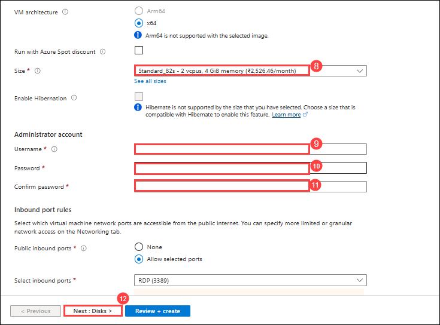

# Step-by-Step VM Deployment Manual

## objective

The objective of this guide is to provide a clear, step-by-step approach to deploying Virtual Machines (VMs) efficiently and securely across various environments. It aims to equip IT professionals, system administrators, and DevOps engineers with the necessary knowledge and best practices to plan, configure, deploy, and manage VMs using automated and manual methods. This guide ensures consistency, scalability, and optimal performance in VM deployments, while aligning with organizational IT policies and cloud architecture standards.

## Task 1: Deplyment of VM

In this Ex you will be deploying an VM 

1. On the **Azure portal**, click on search bar, search for **Vitutual machine** **(1)**, and select **Vitutual machine** **(2)**.

   

2. In the **Compute infrastructure | Virtual machines** tab, click on **+ Create** **(1)** drop-down button and select **Azure Vitutual machine** **(2)**.

   

3. In the Basic tab fill the fallowing details and click on **Next : Disk >**

   - Subscription : Select **default Subscription** **(1)**
   - Resource group: Select **Labvm RG** **(2)**
   - Virtual machine name: enter the VM name as **demovm** **(3)**.

      

      

      | XYZ | Descrio |
      | --- | --- |
      | Subscription | Select **default Subscription** **(1)** |
